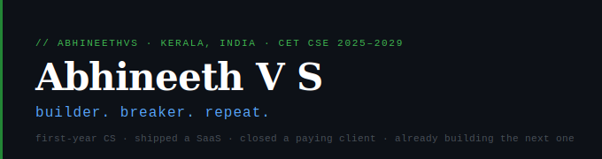

<div align="center">



[](https://abhineethvs.github.io)&nbsp;
[](https://www.linkedin.com/in/abhineethvs)&nbsp;
[](mailto:abhineethvs71@gmail.com)&nbsp;
[](https://app.usegymflow.com)

</div>

---

## shipped

### 🟢 GymFlow &nbsp;·&nbsp; [app.usegymflow.com](https://app.usegymflow.com) &nbsp;`live · paying client`

Full-stack gym management SaaS, built, deployed, and closed a real paying client as a first-year student.
MERN stack · Azure App Service · MongoDB Atlas · Custom domain + SSL · *Private repo*

`React` `Node.js` `Express` `MongoDB` `Azure` `REST API`

---

### 🔵 [VerifeYe AI](https://github.com/AbhineethVS/Verifeye-AI-EE-IPR-) &nbsp;·&nbsp; `open source`

AI-powered deepfake photo & video detection. Team of 5. Python + Flask + HuggingFace transformers.

`Python` `Flask` `HuggingFace` `OpenCV`

---

### 🟠 Wanderlust &nbsp;·&nbsp; `wip`

Full Airbnb clone built without vibecoding; every line written and understood.

`Node.js` `Express` `MongoDB` `EJS`

---

## stack

```
Frontend   React · Next.js · HTML / CSS / JS
Backend    Node.js · Express · REST APIs
Database   MongoDB · MongoDB Atlas
AI / ML    Python · Flask · HuggingFace · LLM APIs · MCP
Infra      Azure · Namecheap · SSL
Tooling    Cursor · Claude · ChatGPT · Prompt Engineering
```

---

## a bit more

-  Attended **YC Startup School India '26**
-  Obsessed with AI agents, cursor workflows, and pushing LLMs to their limits
-  Always have something half-built in a tab somewhere
-  Thiruvananthapuram, Kerala

---

<div align="center">
  <sub>kerala · india · building something always</sub>
</div>
