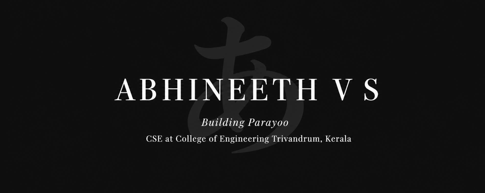

 

PRODUCT BUILDER &nbsp;/&nbsp; FULL-STACK DEVELOPER &nbsp;/&nbsp; AI EXPLORER

 

## SELECTED WORK

<table>
<tr>
<td width="50%" valign="top">

### [PARAYOO](https://parayoo-early-access.vercel.app/)

`EARLY ACCESS` &nbsp; `PRIVATE`

An Android voice input for Malayalis who think in Malayalam and text in Manglish. Speak naturally from any app and get send-ready Manglish in place.

**Kotlin** &nbsp; **Android** &nbsp; **Speech**

</td>
<td width="50%" valign="top">

### [GYMFLOW](https://app.usegymflow.com)

`LIVE` &nbsp; `PAYING CLIENT`

A full-stack gym management SaaS built, deployed, and sold to a real client during my first year.

**React** &nbsp; **Node.js** &nbsp; **MongoDB** &nbsp; **Azure**

</td>
</tr>
<tr>
<td width="50%" valign="top">

### [EXPLODING CHICKENS](https://aadithya-pradeep.itch.io/exploding-chickens)

`LIVE` &nbsp; `GMTK 2026`

A chaotic farm survival game with countdown bombs, wild chicken types, and Story and Chaos modes. Built by a team of three.

**Unity** &nbsp; **C#** &nbsp; **2D URP** &nbsp; **Game Jam**

</td>
<td width="50%" valign="top">

### [VERIFEYE AI](https://github.com/AbhineethVS/Verifeye-AI-EE-IPR-)

`OPEN SOURCE` &nbsp; `TEAM OF 5`

AI-powered deepfake detection for photos and video, built with transformer models and computer vision tooling.

**Python** &nbsp; **Flask** &nbsp; **HuggingFace** &nbsp; **OpenCV**

</td>
</tr>
<tr>
<td width="50%" valign="top">

### WANDERLUST

`IN PROGRESS`

A full Airbnb clone built from first principles, with every line written and understood.

**Node.js** &nbsp; **Express** &nbsp; **MongoDB** &nbsp; **EJS**

</td>
<td width="50%" valign="top">

### CURRENTLY

`BUILDING PARAYOO`

Exploring AI agents, sharp Cursor workflows, and practical products that move from idea to deployment.

**Thiruvananthapuram** &nbsp; **Kerala** &nbsp; **India**

</td>
</tr>
</table>

 

## TOOLKIT

 

<table>
<tr>
<td><b>FRONTEND</b></td>
<td>React, Next.js, HTML, CSS, JavaScript</td>
</tr>
<tr>
<td><b>BACKEND</b></td>
<td>Node.js, Express, REST APIs, Flask</td>
</tr>
<tr>
<td><b>AI / ML</b></td>
<td>HuggingFace, LLM APIs, OpenCV, MCP</td>
</tr>
<tr>
<td><b>INFRA</b></td>
<td>Azure, MongoDB Atlas, custom domains, SSL</td>
</tr>
</table>

 

## OFF THE CLOCK

Attended **YC Startup School India '26**. Usually experimenting with agent workflows, testing the edges of LLMs, or keeping one more half-built idea open in a tab.

 

KERALA &nbsp;·&nbsp; INDIA &nbsp;·&nbsp; BUILDING SOMETHING ALWAYS

