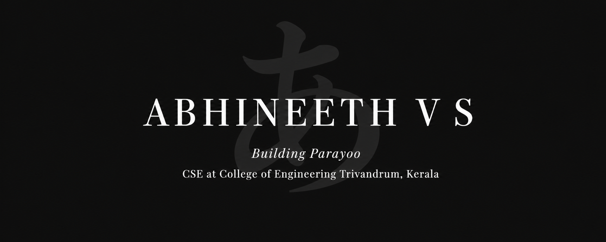

<div align="center">

<a href="https://abhineethvs.vercel.app/">
  
</a>

<br>

[](https://abhineethvs.vercel.app/)
[](https://www.linkedin.com/in/abhineethvs)
[](mailto:abhineethvs71@gmail.com)

<sub>FOUNDER @ PARAYOO &nbsp;/&nbsp; CSE @ CET &nbsp;/&nbsp; AI · ML &nbsp;/&nbsp; SOFTWARE ENGINEER</sub>

</div>

<br>

## FLAGSHIP

<table>
<tr>
<td width="100%" valign="top">

### [PARAYOO](https://www.parayoo.in/) &nbsp;·&nbsp; *Speak Malayalam. Text Manglish.*

`LAUNCHING SOON` &nbsp; `FOUNDER` &nbsp; `ANDROID`

A lot of Malayalis casually text in Manglish on WhatsApp, Instagram, and everywhere else, but typing it out is slow and there's no "right" spelling. **Parayoo** puts a floating bubble over any app: hold it, say what you mean in Malayalam, and it types natural Manglish straight into the chat field. It reads the way you'd actually write it, not like a stiff transliteration.

It isn't a keyboard. It works *with* your keyboard: no switching apps, no copy-paste, no account, private by design.

```
hold bubble  →  speak Malayalam  →  Sarvam STT  →  LLM Manglish rewrite  →  auto-typed into any app
```

**Kotlin** &nbsp; **Android** &nbsp; **Accessibility Service** &nbsp; **Sarvam AI** &nbsp; **LLMs** &nbsp; **PostHog**

[](https://www.parayoo.in/)

</td>
</tr>
</table>

<br>

## SELECTED WORK

<table>
<tr>
<td width="50%" valign="top">

### [TOOTHPASTE.CV](https://toothpaste-cv.vercel.app/)

`LIVE` &nbsp; `DSOLVE 2026 · CET` &nbsp; `TEAM OF 4`

A two-minute oral health screening in the browser. Five guided photos go through GPT and Claude vision in parallel, then a **custom-trained CV layer** (YOLOv11 crowding detector, CLIP stain and wear classifiers) draws boxes and heatmaps, and the result is a dentist-ready report.

**Next.js** &nbsp; **FastAPI** &nbsp; **YOLOv11** &nbsp; **OpenCLIP** &nbsp; **Supabase**

</td>
<td width="50%" valign="top">

### [LUMA](https://luma-study.onrender.com/)

`LIVE` &nbsp; `RAG` &nbsp; `EDTECH`

A study desk for your course PDFs that only answers from your sources. Every answer carries backend-validated page citations that open the exact page. Studio turns the same sources into summaries, flashcards, quizzes, teach-back, and voice study.

**React** &nbsp; **FastAPI** &nbsp; **OpenAI** &nbsp; **PyMuPDF** &nbsp; **Sarvam** &nbsp; **Docker**

</td>
</tr>
<tr>
<td width="50%" valign="top">

### [ETLABAN](https://etlaban.vercel.app/)

`LIVE` &nbsp; `PWA` &nbsp; `OPEN SOURCE`

*Same data, less suffering.* A fast, calm replacement front-end for CET's ETLab portal. It shows attendance, how many classes you can still skip, a per-period calendar, SGPA charts, and study materials. It's read-only, credentials are never stored server-side, and it works offline.

**Python** &nbsp; **JavaScript** &nbsp; **PWA** &nbsp; **Web Scraping** &nbsp; **Vercel**

</td>
<td width="50%" valign="top">

### [PARAYOO KEYBOARD LAB](https://github.com/AbhineethVS/wisprflow-sandbox)

`R&D` &nbsp; `ANDROID INTERNALS`

A black-box test harness that pushes Android through dozens of keyboard and focus states to learn exactly when Wispr Flow shows its bubble. It showed empirically that the trigger is the IME window (`TYPE_INPUT_METHOD`), not editable focus, and that finding now drives Parayoo's overlay logic.

**Kotlin** &nbsp; **Accessibility APIs** &nbsp; **IME** &nbsp; **Android SDK 36**

</td>
</tr>
<tr>
<td width="50%" valign="top">

### [EXPLODING CHICKENS](https://aadithya-pradeep.itch.io/exploding-chickens)

`PLAYABLE` &nbsp; `GMTK GAME JAM 2026` &nbsp; `TEAM OF 3`

A chaotic farm-survival game made for GMTK 2026. Protect your flock from countdown bombs and a growing roster of wild chicken types, in either Story or Chaos mode.

**Unity** &nbsp; **C#** &nbsp; **2D URP** &nbsp; **Game Jam**

</td>
<td width="50%" valign="top">

### [GYMFLOW](https://app.usegymflow.com)

`LIVE` &nbsp; `PAYING CLIENT`

A full-stack gym management SaaS. I built it, deployed it, and sold it to a real client in my first year of college.

**React** &nbsp; **Node.js** &nbsp; **MongoDB** &nbsp; **Azure**

</td>
</tr>
</table>

<details>
<summary><b>MORE FROM THE WORKSHOP</b></summary>

<br>

| Project | What it is | Stack |
|---|---|---|
| [**EPFO Resolve**](https://epfo-resolve.vercel.app/) | A hackathon build that walks you through a PF transfer stuck on a contradictory EPS record, with a guard-railed AI assistant, voice input, and PDF case summaries. | Next.js · OpenAI · Supabase |
| [**Splitline**](https://splitline-theta.vercel.app) | Pick any movie or show, change one moment, and Claude writes the alternate timeline. | JS · TMDB · Claude |
| [**Long Story Short**](https://long-story-short-rho.vercel.app) | A spoiler-free recap of a series up to the exact episode you stopped at. | PWA · TVMaze · Claude |
| [**Notebook JK**](https://github.com/AbhineethVS/notebook-jk) | A Chrome extension that brings GPT, Claude, and Perplexity into NotebookLM's chat. | TypeScript · Chrome MV3 |

</details>

<br>

## TOOLKIT

<table>
<tr>
<td width="18%"><b>LANGUAGES</b></td>
<td>


</td>
</tr>
<tr>
<td><b>AI / ML</b></td>
<td>


<sub>RAG · embeddings · vision models · structured outputs · STT / TTS · MCP · agent workflows</sub>

</td>
</tr>
<tr>
<td><b>FRONTEND</b></td>
<td>


</td>
</tr>
<tr>
<td><b>BACKEND</b></td>
<td>


</td>
</tr>
<tr>
<td><b>MOBILE & GAMES</b></td>
<td>


</td>
</tr>
<tr>
<td><b>INFRA & TOOLS</b></td>
<td>


</td>
</tr>
</table>

<br>

## OFF THE CLOCK

Attended **YC Startup School India '26**. Built at **DSOLVE**, **GMTK**, and a string of AI hackathons. Usually taking apart how other products work, testing the edges of LLMs, or keeping one more half-built idea open in a tab.

<br>

<div align="center">

<sub>THIRUVANANTHAPURAM &nbsp;·&nbsp; KERALA &nbsp;·&nbsp; BUILDING SOMETHING ALWAYS</sub>

</div>
